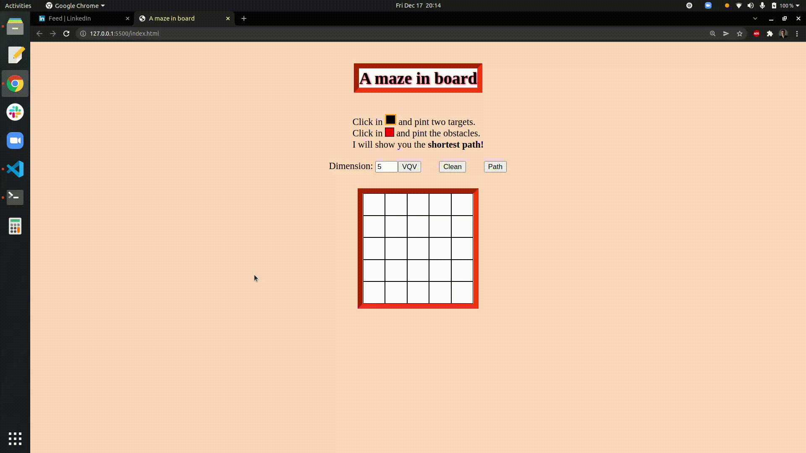

# A Maze in Board
Este projeto é uma aplicação de teoria de grafos utilizando
fundamentos de desenvolvimento web. O objetivo da aplicação é determinar
o menor caminho entre dois pixels, que são escolhidos pelo usuário
tanto quanto os pixels obstáculos a serem evitados.

Para isso, o controle dos elementos HTML
é feito através do DOM
(Document Object Model). Cada pixel possui um id que se refere a um nó
específico do grafo
em grid a ser solucionado. Desta forma, é possível renderizar a solução
encontrada pelo Breath-Search Algorithm (BSA).
 

## Demonstração




## Tecnologias

HTML, CSS, JavaScript


## Rodando localmente

Clone o projeto

```bash
  git clone git@github.com:mpchristian/A-maze-in-board.git
```

Entre no diretório do projeto

```bash
  cd A-maze-in-board
```

Abra o arquivo `index.html` com seu navegador. Caso utilize o Google Chrome,

```bash
  google-chrome index.html
```

## Referência

 - [Breath-Search Algorithm](https://levelup.gitconnected.com/finding-the-shortest-path-in-javascript-pt-1-breadth-first-search-67ae4653dbec)


## Feedback

Se você tiver algum feedback, por favor envie para christianp3m@gmail.com